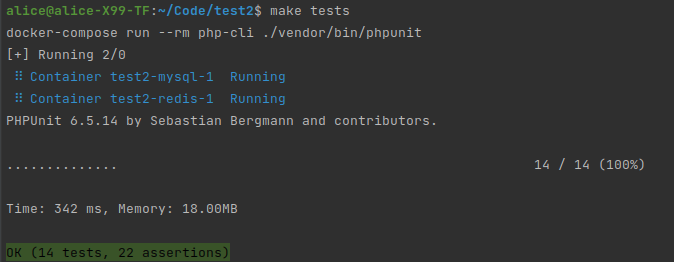

Используется Laravel 5.5 для тестового задания.

Первоначальные настройки :  
nginx - в качестве сервера  
php-cli - окружение( ubuntu 16.4 ) c 7.2.15 + composer  
php-fpm - с 7.2.15  
mysql 5.7   
redis 
```
make init
```
Для запуска тестов :
```
make tests 
```

Подробнее в Makefile.



Выполнена первая часть задания: 


